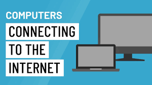
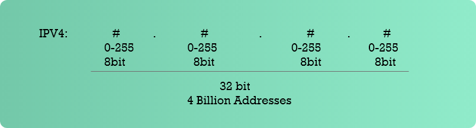
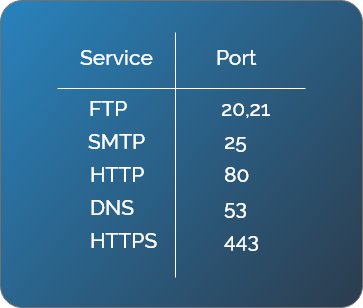

Ever wonderd how the communication bewteen computers and other devices over the internet takes place?
 
                                       
 
When the devices send or receive something over the internet it is done based on some set of protocols/basic rules to follow that decides how these devices should be communicating.
One of these protocols is called TCP/IP (Transmisson control protocol/Internet protocol). Each device on the internet has an address known as IP Address.

The format of the IP address is :
 
 
 

This new IP address version namely IPV6 is being deployed to fulfill the need for more Internet addresses. It was aimed to resolve issues which are associated with IPv4. With 128-bit address space, it allows 340 undecillion unique address space. IPv6 also called IPng (Internet Protocol next generation).
 
 

Any package or information sent or received by a device can be in any form like email, webpage, file etc. Each of these are necessary to be identified. They have a designated port number.  Some of the services and their port numbers are listed below.
 

When someone sends something over the internet, along with the IP address the port number is also sent.
Ex: 1.2.3.4 : 80

When we type some URL it sends an request to the server or some device. But each device is recognized using IP address and not the URL so how does the device get the IP address from the URL? To understand this we need to learn something called as DNS (Domain Name System). DNS is a method of mapping the URL to its corresponding IP address. Once DNS has converted the URL into an IP address, the routers on the Internet will know how to route your TCP/IP packet.

> > The client makes a HTTP (Hyper Text Transfer Protocol ) request that is served up by the server and sends a response back. HTTP is related to what is being communicated i.e content of the request and content of the response. 

> > A similar abbreviation, HTTPS means Hyper Text Transfer Protocol Secure. Basically, it is the secure version of HTTP. Communications between the browser and website are encrypted by Transport Layer Security (TLS), or its predecessor, Secure Sockets Layer (SSL).

The HTTP request and reponse looks something like :

HTTP REQUEST:
                 GET/HTTP/1.1
                 Host: www.google.com
                 …

HTTP RESPONSE:
                 HTTP/1.1 200 OK
                 Content-Type: text/html
                 …
                 
The Get request is sent along with version and host to be communicated with and the response sends the version and HTTP status code and message along with content type and some more information.

Some of the HTTP status codes and their messages are:
 
 

 
For more details on Status codes refer: (https://httpstatuses.com/)
